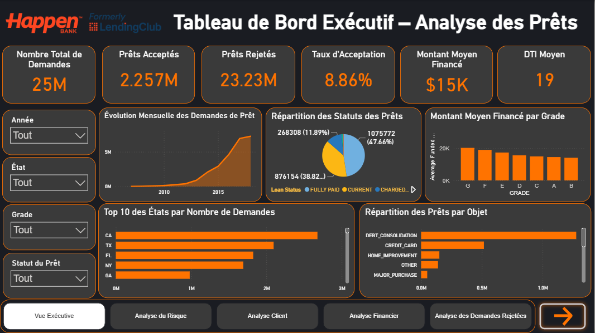
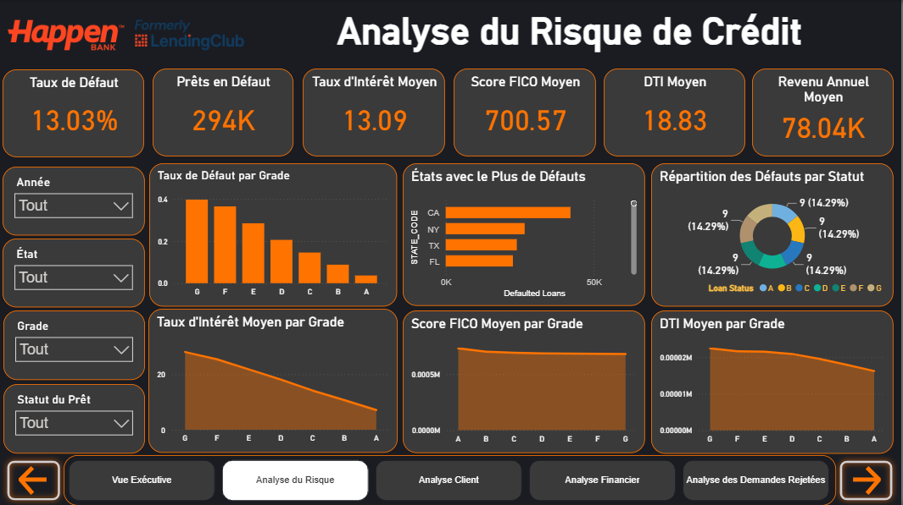
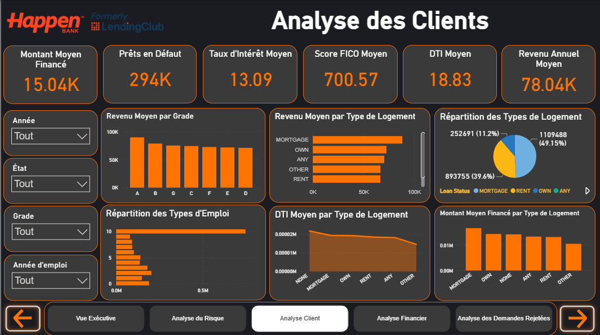
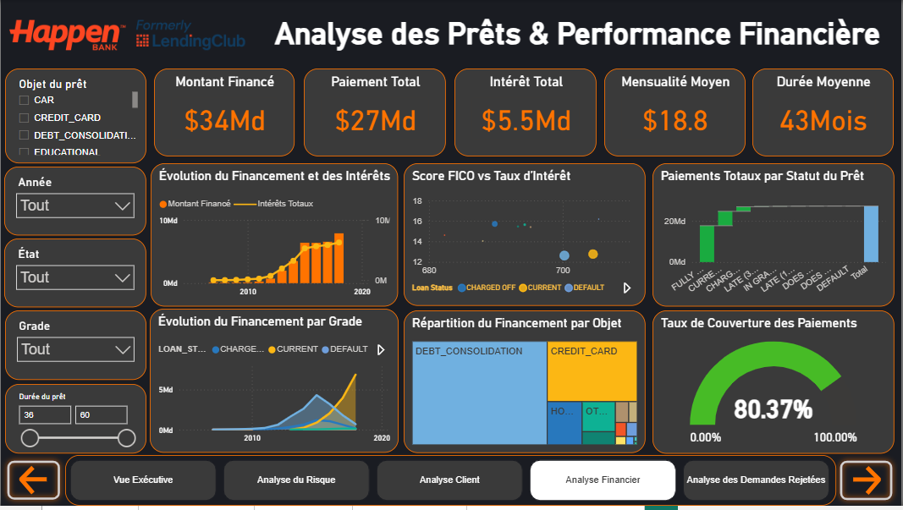
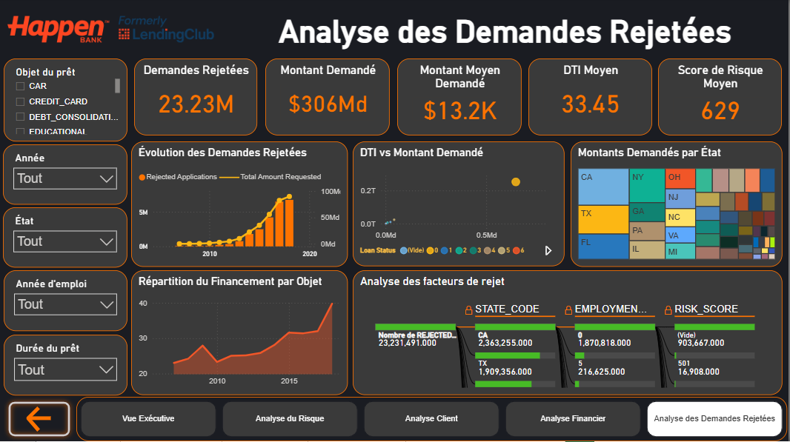
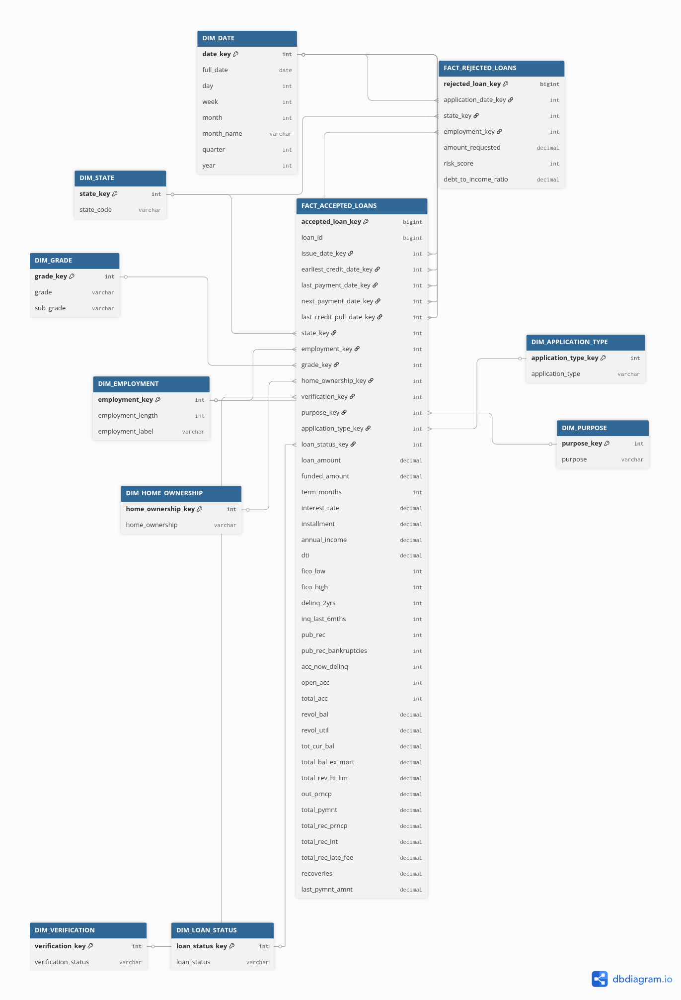
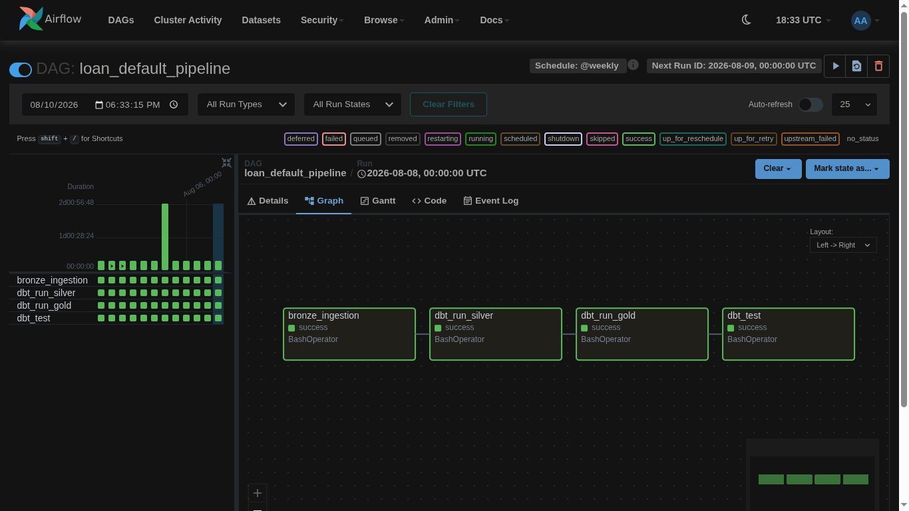

# Loan Default Analytics Platform

## 1. Nom du projet

**Nom du projet :** Loan Default Analytics Platform

---

## 2. Présentation du projet

Ce projet est une **plateforme d'analyse de données** qui permet de collecter, transformer et analyser des données de prêts bancaires afin d'évaluer le risque de défaut de paiement des emprunteurs.

Il s'adresse principalement aux **analystes de données, data engineers et institutions financières** souhaitant disposer d'un pipeline fiable pour suivre et comprendre les indicateurs de risque de crédit.

Son objectif principal est de **construire un pipeline de données de bout en bout (ingestion, transformation, modélisation et reporting) permettant d'identifier les facteurs de défaut de paiement des prêts et de produire des indicateurs exploitables pour la prise de décision**.

---

## 3. Problématique

Le problème identifié est que **les institutions financières manquent souvent d'un pipeline de données structuré et automatisé pour transformer les données brutes de prêts en indicateurs de risque fiables, actualisés et exploitables**.

La solution proposée permet de **centraliser les données de prêts dans une architecture en couches (bronze), de les transformer avec dbt selon des règles métier claires, d'orchestrer l'ensemble du pipeline avec Airflow, puis de restituer les résultats sous forme de rapports et de tableaux de bord**.

---

## 4. Fonctionnalités principales

- Ingérer les données brutes de prêts dans une couche bronze
- Orchestrer les tâches du pipeline de données avec Apache Airflow
- Transformer et modéliser les données avec dbt (dbt_project)
- Exécuter des tests automatisés pour valider la qualité des données
- Générer des rapports d'analyse du risque de défaut de crédit
- Déployer l'environnement complet via Docker
- Automatiser l'intégration continue avec GitHub Actions

---

## 5. Technologies utilisées

| Technologie | Utilisation dans le projet |
|-------------|----------------------------|
| Python | Développement des scripts de traitement et d'orchestration des données |
| Apache Airflow | Orchestration et planification des tâches du pipeline de données |
| dbt (Data Build Tool) | Transformation, modélisation et documentation des données dans l'entrepôt |
| Docker | Conteneurisation de l'environnement pour un déploiement reproductible |
| GitHub Actions | Automatisation de l'intégration continue (CI) |
| Pytest | Tests automatisés de la qualité et de la fiabilité du pipeline |

---

## 6. Installation et lancement

### 6.1 Prérequis

Pour utiliser ce projet, vous devez disposer de :

- Python 3.9 ou version supérieure
- Docker et Docker Compose
- Git
- pip
- Un compte permettant l'accès à Apache Airflow (interface locale)

### 6.2 Cloner le dépôt

```bash
git clone https://github.com/ayoub-data-analyst/loan-default-analytics-platform.git
```

### 6.3 Ouvrir le dossier

```bash
cd loan-default-analytics-platform
```

### 6.4 Installer les dépendances

```bash
pip install -r requirements.txt
```

### 6.5 Variables d'environnement

Créer le fichier `.env` à la racine du projet.

```env
AIRFLOW__CORE__EXECUTOR=LocalExecutor
AIRFLOW__DATABASE__SQL_ALCHEMY_CONN=
DBT_PROFILES_DIR=./dbt_project
DATABASE_URL=
```

### 6.6 Lancer le projet

```bash
docker build -t loan-default-analytics-platform .
docker compose up
```

### 6.7 Ouvrir le projet

Après le lancement, accédez à l'interface Airflow :

```
http://localhost:8080
```

### Point de vigilance

- Tester toutes les commandes avant publication
- Vérifier les chemins d'accès aux dossiers (bronze, dbt_project, airflow)
- Ne jamais publier :
  - mots de passe
  - clés API
  - tokens
  - identifiants de base de données

---

## 7. Captures d'écran

### Capture 1

**Titre :** Vue Exécutive



Cette capture montre le tableau de bord exécutif qui synthétise les principaux indicateurs clés (KPI) du portefeuille de prêts pour une lecture rapide par la direction.

### Capture 2

**Titre :** Analyse du Risque



Cette capture montre l'analyse détaillée du risque de défaut de paiement, avec la répartition des prêts selon leur niveau de risque.

### Capture 3

**Titre :** Analyse Client



Cette capture montre le profil des emprunteurs (segmentation, caractéristiques démographiques et comportementales) utilisé pour évaluer le risque de crédit.

### Capture 4

**Titre :** Analyse Financière



Cette capture montre les indicateurs financiers du portefeuille de prêts (montants, taux, revenus) permettant d'évaluer la santé financière globale des emprunteurs.

### Capture 5

**Titre :** Analyse des Demandes Rejetées



Cette capture montre l'analyse des demandes de prêt rejetées, avec les principaux motifs de refus identifiés.

### Capture 6

**Titre :** Modèle de données (ERD)



Cette capture montre le schéma entité-relation (ERD) du modèle de données, illustrant la structure des tables et leurs relations au sein de l'entrepôt de données.

### Capture 7

**Titre :** Pipeline Airflow — DAG loan_default_pipeline



Cette capture montre le DAG `loan_default_pipeline` orchestré par Airflow, qui exécute successivement les étapes `bronze_ingestion`, `dbt_run_silver`, `dbt_run_gold` et `dbt_test`, avec une planification hebdomadaire.

---

## 8. Contribution personnelle

Ma contribution principale a porté sur **la conception et la mise en place du pipeline de données complet, de l'ingestion des données brutes jusqu'à la restitution des indicateurs de risque**.

J'ai également travaillé sur **la configuration d'Airflow pour l'orchestration des tâches et la mise en place des modèles dbt pour la transformation des données**.

J'ai été responsable de **la structuration du dépôt (couche bronze, dossier dbt_project, tests) ainsi que de la mise en place de l'intégration continue avec GitHub Actions**.

---

## 9. Difficultés rencontrées

### Difficulté 1

**Problème rencontré :** La synchronisation entre les tâches Airflow et les modèles dbt provoquait des erreurs d'exécution lors des mises à jour de la couche bronze.

**Recherches / Tests :** J'ai consulté la documentation officielle d'Airflow et de dbt, et testé différents opérateurs pour déclencher les commandes dbt depuis Airflow.

**Solution :** J'ai résolu le problème en configurant un opérateur dédié qui exécute les commandes dbt uniquement après la validation complète de l'ingestion des données dans la couche bronze.

**Ce que j'ai appris :** Cette difficulté m'a permis d'apprendre à gérer les dépendances entre tâches dans un pipeline orchestré et à mieux comprendre le fonctionnement interne d'Airflow.

### Difficulté 2

**Problème rencontré :** Certains tests de qualité de données échouaient de manière incohérente selon l'environnement d'exécution (local vs conteneur Docker).

**Recherches / Tests :** J'ai comparé les configurations d'environnement entre l'exécution locale et l'exécution via Docker, et vérifié les versions des dépendances installées.

**Solution :** J'ai résolu le problème en figeant les versions des dépendances dans `requirements.txt` et en alignant les variables d'environnement entre les deux contextes.

**Ce que j'ai appris :** Cette difficulté m'a permis d'apprendre l'importance de la reproductibilité des environnements dans un projet data engineering.

---

## 10. Améliorations possibles

Dans une prochaine version, je pourrais :

- ajouter des couches silver et gold pour enrichir l'architecture médaillon ;
- renforcer les tests automatisés de qualité de données ;
- intégrer un tableau de bord interactif (Power BI ou Looker Studio) ;
- déployer le pipeline complet sur un environnement cloud.

**Conclusion :** Ces améliorations permettraient de **rendre le pipeline plus robuste, plus complet et plus facilement exploitable en production par une équipe data**.
